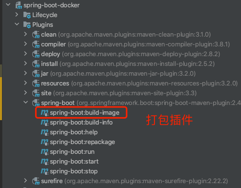
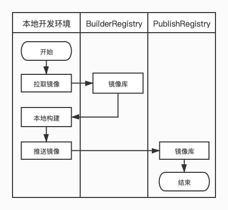
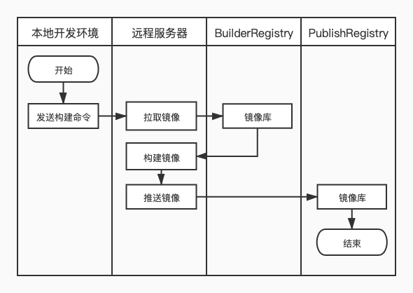

= SpringBoot 打包成 docker 镜像
:icons: fonts
:toc: right
:pdf-themesdir: themes

== 快速使用

SpringBoot 2.3 之后支持直接打包成 docker 镜像，不需要再依赖第三插件或者dockerfile springboot 自带插件已经支持打包成镜像。

[source,xml]
----
<plugin>
    <groupId>org.springframework.boot</groupId>
    <artifactId>spring-boot-maven-plugin</artifactId>
</plugin>
----

使用 springboot 官方脚手架 搭建好初始化项目之后，即可直接打包成docker 镜像

[source,shell]
----
mvn spring-boot:build-image
----

在 IDEA 也可以看到对应的插件

注意： 默认的打包方式需要本地有 docker 环境，打包完成后通过

[source,shell]
----
docker images
----

命令查看镜像。

== 镜像自定义项

springboot 打包插件会调用一个构建器来构建镜像。构建器包括多个 buildpacks, 可以检查应用程序生成的影响镜像。默认情况下, 插件选择builder镜像。推导出镜产生的名字像从项目属性。

镜的像参数允许配置的建设者和如何操作这个项目。下表总结了可用参数及其默认值:

.镜像自定义参数
|===
|参数|描述|属性|默认值

|builder
|构建镜像的名称
|spring-boot.build-image.builder
|paketobuildpacks/builder:base

|runImage
|运行镜像的名称
|spring-boot.build-image.runImage
|paketobuildpacks/run:base-cnb

|name
|生产镜像的名称
|spring-boot.build-image.imageName
|docker.io/library/${project.artifactId}:${project.version}

|pullPolicy
|从厂库拉取构建镜像和运行镜像的策略(有三个值可选ALWAYS,NEVER,IF_NOT_PRESENT)
|spring-boot.build-image.pullPolicy
|ALWAYS

|env
|向构建器中传递的参数，如jdk版本，jvm运行参数
|无
|无

|cleanCache
|构建之前是否要清楚缓存
|spring-boot.build-image.cleanCache
|false

|verboseLogging
|启用构造器操作的详细日志记录
|无
|false

|publish
|是否将生成的镜像发布到 Docker 仓库。
|spring-boot.build-image.publish
|false

|===

.docker 自定义项
|===
|参数|描述|属性|默认值

|host
|包含Docker守护进程的主机和端口的URL，如果本地有的化可以不写
|无
|默认使用本地

|tlsVerify
|设置为true时启用安全HTTPS协议(可选)
|
|

|certPath
|HTTPS证书和密钥文件的路径(如果tlsVerify为true则需要，否则忽略)
|
|

|builderRegistry
|拉取构建&运行镜像的 registry 地址。包含了账号、密码、url、email
|
|

|publishRegistry
|构建好的镜像发布的 registry 地址包含了账号、密码、url、email
|
|

|===

完整的配置

[source,xml]
----
<configuration>
    <excludeDevtools>false</excludeDevtools>
    <image>
        <!--要使用的构建器映像的名称。默认：paketobuildpacks/builder:base-->
        <builder>shishaodong/paketobuildpacks_builder:latest</builder>
        <!-- 运行时 Image -->
        <runImage>shishaodong/paketobuildpacks_run:latest</runImage>
        <!--映像生成的映像的名称。-->
        <name>shishaodong/${project.artifactId}:${project.version}</name>
        <!-- 拉取镜像的策略，可选的值：ALWAYS, NEVER, IF_NOT_PRESENT。默认 ALWAYS-->
        <pullPolicy>IF_NOT_PRESENT</pullPolicy>
        <!-- 应该传递给构建器的环境变量。-->
        <env>
            <BP_JVM_VERSION>8.*</BP_JVM_VERSION>
            <JAVA_TOOL_OPTIONS>${java.tool.options}</JAVA_TOOL_OPTIONS>
        </env>
        <!--是否需要在建立缓存前清理缓存。默认false-->
        <cleanCache>false</cleanCache>
        <!-- 启用构造器操作的详细日志记录。默认false-->
        <verboseLogging>true</verboseLogging>
        <!-- 执行完build 自动push。默认 false -->
        <publish>false</publish>
    </image>
    <docker>
        <!--配置构建宿主机信息，本机不用配置, 如果远程构建 docker 镜像，需要远程主机开启 TCP 访问-->
        <!-- docker 安装参考 https://www.jianshu.com/p/9702b39e868e -->
        <!-- <host>tcp://10.211.55.4:2375</host> -->
        <tlsVerify>false</tlsVerify>
        <!-- <certPath>/home/user/.minikube/certs</certPath>-->
        <!--                        <builderRegistry>-->
        <!--                            <username>${docker.username}</username>-->
        <!--                            <password>${docker.password}</password>-->
        <!--                            <url>${docker.url}</url>-->
        <!--                            <email>${docker.email}</email>-->
        <!--                        </builderRegistry>-->
        <publishRegistry>
            <username>${docker.username}</username>
            <password>${docker.password}</password>
            <url>${docker.url}</url>
            <email>${docker.email}</email>
        </publishRegistry>
    </docker>
</configuration>
----

账号密码需要被隐藏，可以通过命令行传入。首先在 POM properties 加入标签

[source,xml]
----
<properties>
    <java.version>1.8</java.version>
    <java.tool.options>-Xms200m -Xmx200m</java.tool.options>
    <docker.username/>
    <docker.password/>
    <docker.url/>
    <docker.email/>
</properties>
----

打包命令传入账号密码

[source,shell]
----
mvn -DskipTests spring-boot:build-image -Ddocker.username=MyUsername -Ddocker.password=MyPassword -Ddocker.email=spring-boot@qq.com -Ddocker.url=https://hub.docker.com/
----

== 注意

默认的构建镜像是 paketobuildpacks/builder:base ，构建时会拉取 github 上的一些JDK 和 JRE 文件，由于某些原因会经常拉取失败 已经将原始进行进行了修改下载地址改为了国内。

[source,xml]
----
<image>
    <builder>shishaodong/paketobuildpacks_builder:latest</builder>
    <runImage>shishaodong/paketobuildpacks_run:latest</runImage>
</image>
----

== 本地构建和远程构建区别

本地构建

远程构建

使用远程构建时要注意，远程服务器需要同时能访问 BuilderRegistry 和 PublishRegistry

