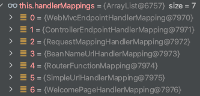

获取本次请求的处理器映射器

参数处理原理
首先从 HandlerMapping 中找到能处理请求的 Handler()

获取本次请求的处理器映射器
`mappedHandler = getHandler(processedRequest);`

确定当前请求的处理程序适配器
`HandlerAdapter ha = getHandlerAdapter(mappedHandler.getHandler());`

org.springframework.web.servlet.mvc.method.annotation.RequestMappingHandlerAdapter

实际调用处理程序
`mv = ha.handle(processedRequest, response, mappedHandler.getHandler());`

