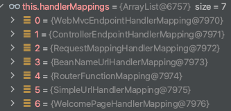

= 参数绑定
:pdf-themesdir: ../themes
:pdf-fontsdir: ../fonts
:pdf-theme: KaiGenGothicCN

== 目录

* 从 URL 路径上获取参数
* 从 RequestBody 中获取参数
* 从 Cookie 中获取参数
* 从表单中获取参数
* 参数矩阵
* 参数解析原理

GET 和 POST 请求区别 参考 link:src/main/asciidoc/get_post.adoc[GET 和 POST 区别]

== 从URL路径上获取参数

简单参数，从URL上获取，可以直接转换成基本类型

[source,java]
----
@Slf4j
@Validated
@RestController
public class PathVariableController {

    @GetMapping("/index/{message}")
    public SpringVO index(@RequestHeader("User-Agent") String agent, @PathVariable String message, @Print String aaa) {
        log.info("RestController - PathVariableController");
        return SpringVO.builder().agent(agent).message(message + "  " + aaa).build();
    }

}
----

请求

[source,http request]
----
GET http://localhost:8899/index/ssssss
Accept: application/json
----

响应

[source,text]
----
GET http://localhost:8899/index/ssssss

HTTP/1.1 200
Content-Type: application/json
Transfer-Encoding: chunked
Date: Thu, 11 Mar 2021 02:57:35 GMT
Keep-Alive: timeout=60
Connection: keep-alive

{
  "agent": "Apache-HttpClient/4.5.12 (Java/11.0.9.1)",
  "message": "ssssss  null"
}

Response code: 200; Time: 5479ms; Content length: 77 bytes
----

支持逗号分隔的基本类型接转换成集合

[source,java]
----
@Slf4j
@RestController
@RequiredArgsConstructor
public class PathVariableController {

    private final ObjectMapper objectMapper;

    @SneakyThrows(JsonProcessingException.class)
    @GetMapping("path/many/{ids}")
    public ResultVO<Set<Long>> many(@PathVariable("ids") Set<Long> ids) {
        log.error("路径获取多个参数:{}", objectMapper.writeValueAsString(ids));
        return ResultVO.success(ids);
    }
}
----

请求

[source,http request]
----
GET http://localhost:8899/path/many/11,22,33,44
Accept: application/json
----

响应

[source,text]
----
GET http://localhost:8899/path/many/11,22,33,44

HTTP/1.1 200
Content-Type: application/json
Transfer-Encoding: chunked
Date: Thu, 11 Mar 2021 03:01:27 GMT
Keep-Alive: timeout=60
Connection: keep-alive

{
  "status": 200,
  "data": [
    11,
    22,
    33,
    44
  ]
}

Response code: 200; Time: 217ms; Content length: 35 bytes
----

== 从 RequestBody 中获取参数

从 body 中请求数据，一般用于 POST、PUT 请求

[source,java]
----
@Slf4j
@RestController
public class RequestBodyController {

    @PostMapping("/body")
    public ResultVO<UserInfoDTO<BookDTO>> body(@RequestBody UserInfoDTO<BookDTO> userInfo) {
        log.debug("This is {} log", string());
        return ResultVO.success(userInfo);
    }
    private String string() {
        log.debug("test debug");
        return "debug";
    }
}
----

请求

[source,http request]
----
POST http://localhost:8899/body
Content-Type: application/json

{
  "name": "123",
  "date": "202102251024",
  "data": {"title": "Core Technologies","author": "Container"}
}
----

响应

[source,text]
----
POST http://localhost:8899/body

HTTP/1.1 200
Content-Type: application/json
Transfer-Encoding: chunked
Date: Thu, 11 Mar 2021 03:04:07 GMT
Keep-Alive: timeout=60
Connection: keep-alive

{
  "status": 200,
  "data": {
    "name": "123",
    "date": "202102251024",
    "data": {
      "title": "Core Technologies",
      "author": "Container"
    }
  }
}

Response code: 200; Time: 303ms; Content length: 116 bytes
----

== 从 Cookie 中获取参数

[source,java]
----
@Slf4j
@RestController
public class RequestCookieController {

    @GetMapping("cookie")
    public ResultVO<String> cookie(@CookieValue(name = "testCookie") String testCookie) {
        log.debug("testCookie - {}", testCookie);
        return ResultVO.success(testCookie);
    }
}
----

== 从表单中获取参数

[source,java]
----
@Slf4j
@RestController
public class RequestParamController {

    @GetMapping("param1")
    public ResultVO<String> param1(@RequestParam(name = "name") String name) {
        return ResultVO.success(name);
    }

    @GetMapping("param2")
    public ResultVO<UserInfoDTO> param2(UserInfoDTO user) {
        return ResultVO.success(user);
    }
}
----

== 参数矩阵

== 参数解析原理

获取本次请求的处理器映射器

参数处理原理 首先从 HandlerMapping 中找到能处理请求的 Handler()

获取本次请求的处理器映射器
`mappedHandler = getHandler(processedRequest);`

确定当前请求的处理程序适配器
`HandlerAdapter ha = getHandlerAdapter(mappedHandler.getHandler());`

org.springframework.web.servlet.mvc.method.annotation.RequestMappingHandlerAdapter

实际调用处理程序
`mv = ha.handle(processedRequest, response, mappedHandler.getHandler());`

